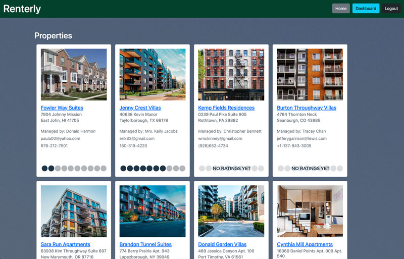
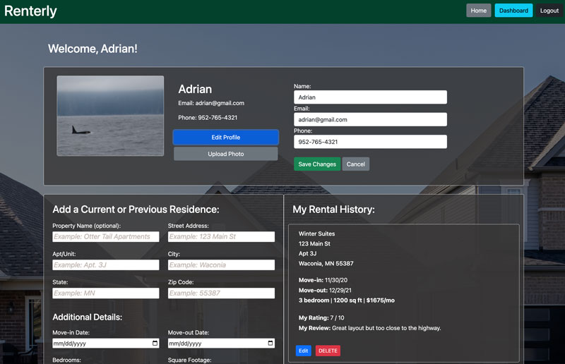

# Renterly

## Project Description

As a renter, I would like a web app that allows me to track my rental history, show my recommendations from other roommates and property managers, and list my contact info.

## Acceptance Criteria

-   I can create a new login, password, and access my profile page.
-   I can register as either a renter user or a property manager user.
-   As a renter user, I can add my contact info, previous addresses, details about the rentals, and my rating and review.
-   As a renter user, I can upload a photo.
-   As a renter user, I can request recommendations from other renters or property managers.
-   As a renter user, I can add recommendations to other renters.
-   As a property manager, I can add recommendations to renters.
-   The renter profile page will display these items for public views, but a login is necessary to create and edit a renter profile.

## The technology

For this project we used Node.JS, Sequelize, Express, Sessions, MySQL, Handlebars, Bcrypt, Nodemailer, Cloudinary, and custom middleware, authentication, and Javascript.

## Deployed Application

Heroku Link: [Renterly](https://afternoon-forest-27682-c3f9d39e0ce3.herokuapp.com/)
